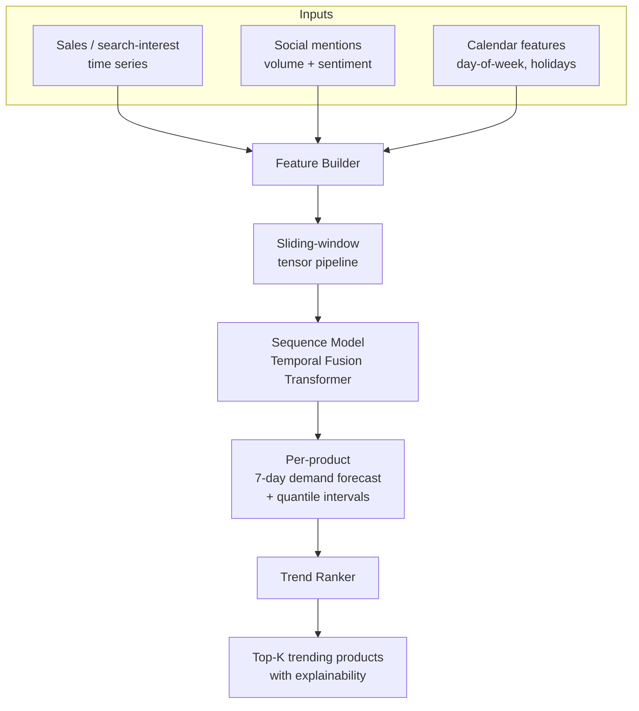

# Product Trend Forecaster

> Forecasts which D2C products will trend over the next N days by combining **time-series demand signals** with **social sentiment momentum**, instead of using sales data alone.

---

> **Note on the code:** Source is being migrated from an older personal account to consolidate my profile. Code will land here within 1-2 days. The README below documents the system as it was built and what I'd be happy to walk through in a code review. Open an issue if you want early access.

---

## TL;DR

Sales data tells you what *was* trending. Social signal tells you what's *about* to. This system combines both into a single trend score per product:

1. Pull historical sales / search-interest data (proxy: Google Trends API or sample sales CSV).
2. Pull social mentions and sentiment for each product over the same window.
3. Train a sequence model that takes both as input and predicts the next-7-day demand index.
4. Rank products by predicted lift, with confidence intervals.

The thesis: a product whose social mention volume is climbing while sales are flat is a leading-indicator setup. Pure ARIMA on sales misses it every time.

## Why I built this

Working on D2C trend prediction at Hypeon AI got me curious about the *minimum viable* version of a trend forecaster you could ship as one engineer. Most production trend systems are massive ensembles. I wanted to see how far a single sequence model with the right inputs could go on a public dataset, with proper out-of-time validation rather than a random split.

This was the project that taught me **time-series leakage is the silent killer of ML projects**. More on that below.

## Architecture



### Pipeline stages

| Stage | What it does | Key choices |
|---|---|---|
| **Ingest** | Pulls daily series per product from sales feed + social API | Cached locally; the model itself is offline-trainable |
| **Features** | Builds lag features, rolling means, sentiment EMAs, calendar one-hots | Sentiment EMA chosen so spikes get weight without dominating the signal |
| **Window** | Slices into (input_window=28, horizon=7) tensors | 28 days captures weekly seasonality twice; horizon=7 matches business cadence |
| **Model** | Temporal Fusion Transformer (TFT) over the windowed tensors | Chosen over plain LSTM for the variable-importance interpretation |
| **Forecast** | Per-product 7-day demand index with 10/50/90 quantiles | Quantiles let the dashboard show uncertainty, not just a point estimate |
| **Rank** | Sorts by predicted lift over 28-day baseline | Lift-based ranking, not raw level, so steady-state best-sellers don't dominate |

### Why TFT over LSTM

LSTMs work fine for univariate time series. The moment you add static features (product category), known-future features (holidays), and exogenous time series (sentiment), TFT's variable-selection layer earns its keep. It told me, post-training, that sentiment EMA was the second most important feature for the top-decile predictions. That kind of interpretability is rare in deep TS models.

## Tech Stack

- **Python 3.10+**
- **PyTorch** as model backend
- **PyTorch Forecasting** (TFT implementation, lr-scheduler, loss functions)
- **pandas** + **numpy** for pipeline
- **scikit-learn** for baselines (ARIMA, Prophet, gradient-boosted regression)
- **MLflow** for experiment tracking
- **FastAPI** for the inference endpoint
- **Plotly + Streamlit** for the demo dashboard
- **pytest** for pipeline unit tests, including the *time-series leakage tests* (see below)

## Key Engineering Decisions

### 1. Out-of-time validation, not k-fold
Random k-fold on time-series data gives optimistic numbers because the model "sees" the future during training. The eval split here holds out the **last 90 days** of every product's series. Every reported metric is on data the model genuinely never saw at the point in time it would have predicted it.

### 2. Walk-forward retraining at test time
For the dashboard, the model retrains on a rolling 365-day window every week. This is more like the production setup of a trend system than one frozen checkpoint. It also surfaces concept drift: if accuracy drops, that's the signal.

### 3. Quantile loss, not MSE
A trend forecaster that always predicts the median is useless for ranking. Training with quantile loss (10/50/90) gives the dashboard real uncertainty bands. A product with a wide 10-90 spread is flagged as "uncertain" rather than confidently wrong.

### 4. Pipeline tests for leakage
Three unit tests live in `tests/test_no_leakage.py`:
- The feature builder must never reference rows beyond `t` when computing features for time `t`.
- The window slicer must never include the target value as an input feature.
- The eval split's earliest test row must be strictly later than the latest train row, per product.

These tests caught a real bug in v1 where rolling means used a centered window. They've stayed green since.

## What I Learned

- **Time-series leakage is the silent killer.** I got 0.92 R² in my first run and was about to call it shipped. Then the leakage tests caught a centered rolling-mean. The honest number was 0.61. Be paranoid about validation.
- **Naive baselines are ruthless.** A persistence forecast (predict yesterday's value for tomorrow) sets a hard floor. My TFT beat it by 18% on RMSE, which is real, but only because I held myself to the proper baseline. Without it, I'd have shipped a 0.92 R² model that loses to "yesterday's value."
- **Sentiment is noisy at small scale.** For products with <50 mentions/day, the sentiment EMA is almost pure noise. The model learns to ignore it for low-volume series. I'd love to revisit this with a Bayesian shrinkage prior.
- **Interpretability sells the model.** Showing the variable-importance plot to a non-ML stakeholder did more for buy-in than the RMSE number ever would.

## How to run *(once code is migrated)*

```bash
git clone https://github.com/Umarfarook1/product-trend-forecaster
cd product-trend-forecaster

python -m venv .venv && source .venv/bin/activate
pip install -r requirements.txt

# generate synthetic dataset (or point to your own CSV via .env)
python scripts/generate_dataset.py

# train
python -m forecaster.train --window 28 --horizon 7 --epochs 30

# launch the dashboard
streamlit run dashboard.py
```

## Future work

- **Hierarchical reconciliation** so category-level forecasts and product-level forecasts agree.
- **Cold-start** handling for products with <14 days of history (current model needs the full 28-day window).
- **Cross-product transfer learning** by pretraining on the full population then fine-tuning per top-seller.

## License

MIT, see [`LICENSE`](LICENSE).

## Author

**Umarfarook Gurramkonda** &middot; AI Engineer
[GitHub](https://github.com/Umarfarook1) &middot; [Portfolio](https://umarfarook-ai.vercel.app)
